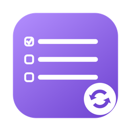
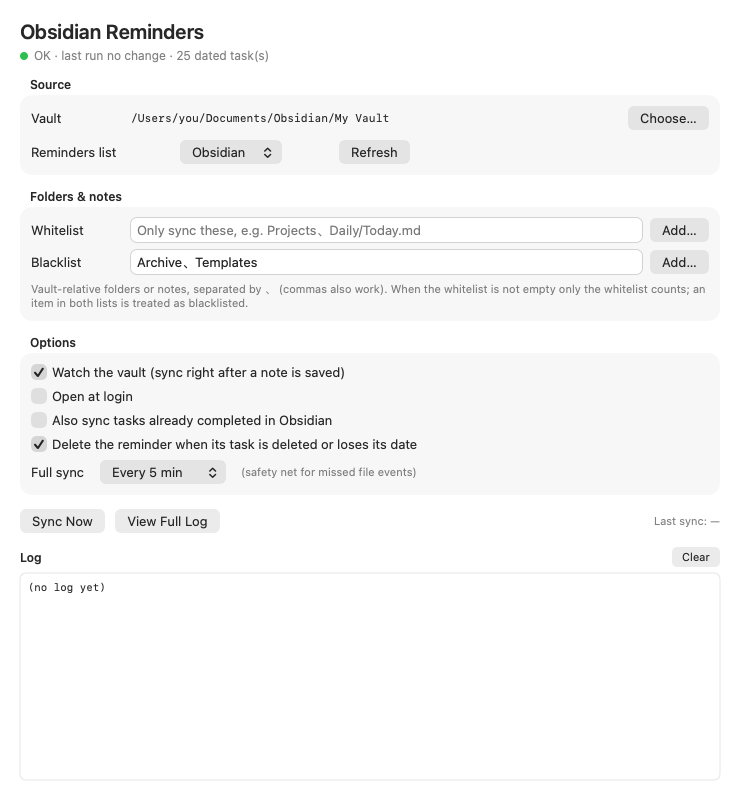

<p align="center"></p>

<h1 align="center">Obsidian Reminders</h1>

**English** | [简体中文](README.zh-CN.md)

A small native macOS app that puts your **dated Obsidian tasks** into Apple **Reminders** — and ticks them off in Obsidian when you complete them in Reminders.

- Only tasks with a due date (📅) or scheduled date (⏳) are synced. Undated to-dos stay in Obsidian.
- Reminder titles are clean plain text: `[[links]]`, `[markdown](links)`, **bold**, `#tags` are all stripped.
- Two-way completion: tick it on your iPhone, and the task becomes `- [x]` in your vault (recurring tasks get their next occurrence).
- Syncs within seconds of saving a note. Runs quietly in the menu bar.
- Whitelist / blacklist folders and notes.
- English and Chinese interface (follows your system language).

<p align="center"></p>

---

## Install in 3 minutes

### What you need

| | |
|---|---|
| A Mac with **macOS 12.3 Monterey or later** (Apple Silicon or Intel) | Apple menu  → About This Mac shows your version |
| **Obsidian** with at least one vault | Download from [obsidian.md](https://obsidian.md/download) |
| The **Reminders** app with iCloud or "On My Mac" enabled | It's built into macOS |

### Step 1 — Install the app

**Option A (easiest): install with npm**

Needs [Node.js](https://nodejs.org) (`node -v` in Terminal shows whether you have it).

1. Press **⌘ Space**, type **Terminal**, press **Return**.
2. Paste this line and press **Return**:

   ```bash
   npm install -g obsidian-reminders && obsidian-reminders
   ```

3. Wait for "Done". The app is now in your **Applications** folder and opens by itself — later, open it from Launchpad or Spotlight like any other app. No "Apple cannot check it" warning.

To update later, run the same line again. Other commands: `obsidian-reminders open`, `obsidian-reminders uninstall`, `obsidian-reminders --help`.

**Option B: download manually**

1. Go to the [latest release](https://github.com/YorenZZZ/obsidian-reminders/releases/latest) and download **Obsidian-Reminders.zip**.
2. Double-click the zip, then drag **Obsidian Reminders** into your **Applications** folder.
3. Double-click the app. macOS will say it *"cannot be opened because Apple cannot check it"* — this is expected for free apps that are not sold through Apple. Click **Done** (or **Cancel**).
4. Open  → **System Settings** → **Privacy & Security**, scroll down, and click **Open Anyway** next to "Obsidian Reminders". Confirm with your password or Touch ID.

> You only have to do step 3–4 once. On macOS 12 Monterey the place is  → **System Preferences** → **Security & Privacy** → **General** → **Open Anyway** (or simply right-click the app → **Open** → **Open**).

### Step 2 — Allow access

The first time the app opens, macOS asks two questions. Answer **yes** to both:

1. **"Obsidian Reminders" would like to access your Reminders** → click **Allow** (choose *Full Access* if asked).
2. **"Obsidian Reminders" would like to access files in your Documents folder** (only if your vault lives there) → click **Allow**.

### Step 3 — Check that it works

1. The app window shows your vault under **Vault**. It is found automatically from Obsidian's own settings. If it says *Not set*, click **Choose…** and select your vault folder (the folder that contains a hidden `.obsidian` folder).
2. Open the **Reminders** app. A new list called **Obsidian** appears with your dated tasks.

That's it. The app keeps running in the menu bar (the ☑︎ checklist icon) and starts automatically when you log in. Closing the window (⌘W) does not stop syncing.

---

## Writing tasks that sync

Write a normal Obsidian task and add a date with the 📅 (due) or ⏳ (scheduled) emoji. The [Tasks](https://publish.obsidian.md/tasks/) community plugin adds these for you, but typing them by hand works too.

```markdown
- [ ] Pay rent 📅 2026-10-01
- [ ] Call [[Mom]] ⏳ 2026-10-03
- [ ] Dentist 📅 2026-10-10 14:30
- [ ] Water the plants 🔁 every week on Sunday 📅 2026-09-27
```

| Obsidian | Reminders |
|---|---|
| `📅 YYYY-MM-DD` (optionally ` HH:mm`) | Due date / time |
| `⏳ YYYY-MM-DD` | Due date when there's no 📅, otherwise start date |
| `🛫 YYYY-MM-DD` | Start date |
| `⏰ YYYY-MM-DD HH:mm` | Alert |
| `🔺` `⏫` `🔼` `🔽` `⏬` | Priority (high → low) |
| `🔁 every …` | Native repeat, when Reminders can represent the rule exactly |
| `✅ YYYY-MM-DD` on a finished task | Completion date |

Title clean-up examples:

| In Obsidian | In Reminders |
|---|---|
| `[[Pets#Weekly\|Groom the cat]]` | `Groom the cat` |
| `[[Fitness#Diet]]` | `Fitness Diet` |
| `Renew [example.com](https://example.com)` | `Renew example.com` |
| `**Important** review \`code\` #work` | `Important review code` |

**What syncs where**

- Tick a task in Obsidian → the reminder is completed. Untick → it reopens.
- Delete a task or remove its date → the reminder is deleted (or just completed, see Options).
- Complete a reminder (on Mac, iPhone, Watch…) → the task becomes `- [x]` in Obsidian. If it has a `🔁` rule, the next occurrence is created, just like the Tasks plugin does.
- Other edits made in Reminders (title, date) are **not** copied back — Obsidian stays the source of truth.
- Reminders you created yourself in the list are never touched.

---

## Choosing which notes sync (whitelist / blacklist)

In the **Folders & notes** section, type vault-relative folder or note paths, separated by `、` (commas also work), or click **Add…** to pick them.

| Whitelist | Blacklist | What syncs |
|---|---|---|
| empty | empty | every note in the vault |
| empty | `Archive、Templates` | everything **except** `Archive/` and `Templates/` |
| `Projects、Daily/Today.md` | anything | **only** `Projects/` and `Daily/Today.md` |
| `Projects、Work` | `Work` | only `Projects/` — an item in both lists counts as blacklisted |

Folders include all their subfolders. For notes the `.md` is optional. Changes apply 1.5 s after you stop typing. Reminders for tasks that fall out of scope are removed.

---

## Options

| Option | Default | |
|---|---|---|
| Reminders list | `Obsidian` | Created automatically if missing |
| Watch the vault | on | Sync 1–3 s after a note is saved |
| Open at login | on | Also listed under System Settings → General → Login Items |
| Also sync completed tasks | off | Mirror `- [x]` tasks as completed reminders |
| Delete reminder when task is gone | on | Off = mark it completed instead |
| Full sync | every 5 min | Safety net in case a file event is missed |

Keyboard: **⌘R** sync now · **⌘W** close window (keeps running) · **⌘1** show window · **⌘Q** quit.

---

## Troubleshooting

| Problem | Fix |
|---|---|
| Banner: *Obsidian is not installed* | Install [Obsidian](https://obsidian.md/download) and create a vault, or click **Choose…** to pick a folder of Markdown notes. |
| Banner: *Access to Reminders is turned off* | Click **Open System Settings** and switch on *Obsidian Reminders* under Privacy & Security → Reminders. The app picks it up when you come back — no restart needed. |
| Banner: *Reminders has no account* | Open Reminders → Settings → Accounts and enable iCloud or *On My Mac*, then click **Sync Now**. |
| A task doesn't show up | It needs `- [ ]`, a 📅 or ⏳ date in `YYYY-MM-DD` form, and must be inside your whitelist / outside your blacklist. |
| *Completed in Reminders but could not update Obsidian* | The task line was edited after you ticked the reminder, so it can't be matched safely. Tick it in Obsidian by hand; the warning disappears. |
| "Apple cannot check it for malicious software" | Install with Option A instead, or see Option B, step 4. |
| Anything else | Click **View Full Log** and look at the last lines. |

---

## Uninstall

1. Quit the app from its menu bar icon → **Quit**.
2. Drag **Obsidian Reminders** from Applications to the Trash. If you installed with npm, run `obsidian-reminders uninstall && npm uninstall -g obsidian-reminders` instead.
3. Optional clean-up — paste into Terminal:

   ```bash
   rm -rf ~/Library/Application\ Support/ObsidianReminders ~/Library/Logs/ObsidianReminders
   ```
   ```bash
   defaults delete io.github.yorenzzz.obsidian-reminders
   ```

The **Obsidian** list in Reminders stays; delete it in Reminders if you no longer need it.

---

## For developers

<details>
<summary>Build from source, tests, internals</summary>

Requires the Xcode Command Line Tools (`xcode-select --install`). No Xcode project — plain `swiftc`.

```bash
git clone https://github.com/YorenZZZ/obsidian-reminders.git
cd obsidian-reminders
./install.sh              # build universal app → /Applications → launch
./scripts/release.sh      # build/Obsidian-Reminders.zip for a GitHub release
```

The app is ad-hoc signed. Each rebuild counts as a new app for macOS privacy, so Reminders access has to be granted again after rebuilding.

Tests:

```bash
swiftc -o /tmp/parse-test Sources/TaskParser.swift Sources/Log.swift Sources/Recurrence.swift Tools/parser-test/main.swift && /tmp/parse-test
swiftc -o /tmp/regress Sources/TaskParser.swift Sources/Log.swift Sources/Recurrence.swift Sources/NativeRecurrence.swift Tools/completion-regression/main.swift && /tmp/regress
swiftc -o /tmp/path-filter-test Sources/PathFilter.swift Tools/path-filter-test/main.swift && /tmp/path-filter-test
```

Command-line diagnostics (no UI):

```bash
APP="/Applications/Obsidian Reminders.app/Contents/MacOS/ObsidianReminders"
"$APP" --dry-run    # scan and print what would be synced; does not touch Reminders
"$APP" --dump       # print what the last sync mirrored
```

How ownership works: Reminders has no hidden fields, so the app keeps a local index (`~/Library/Application Support/ObsidianReminders/reminder-index.json`) mapping each task ID (hash of file path + clean title) to the reminder it created. Reminders it did not create are never modified. Renaming a task in Obsidian therefore replaces its reminder.

| Data | Location |
|---|---|
| Log | `~/Library/Logs/ObsidianReminders/app.log` |
| Index, last-sync snapshot, list state | `~/Library/Application Support/ObsidianReminders/` |
| Settings | `~/Library/Preferences/io.github.yorenzzz.obsidian-reminders.plist` |

```
Sources/
  main.swift             entry point, menus, --dry-run / --dump
  AppDelegate.swift      lifecycle, menu bar, scheduling, login item
  MainWindow.swift       SwiftUI window
  SyncEngine.swift       EventKit sync (create / update / complete / delete, completion import)
  ReminderIndex.swift    task ↔ reminder index
  TaskParser.swift       task parsing, title clean-up, ticking tasks
  Recurrence.swift       next occurrence per Obsidian Tasks rules
  NativeRecurrence.swift 🔁 rule → Reminders repeat rule
  PathFilter.swift       whitelist / blacklist
  VaultScanner.swift     parallel vault scan
  FolderWatcher.swift    FSEvents watcher
  Settings.swift         preferences, vault auto-detection
  L10n.swift             English / Chinese strings
```

</details>

---

## License

[MIT](LICENSE). Not affiliated with Obsidian or Apple.
