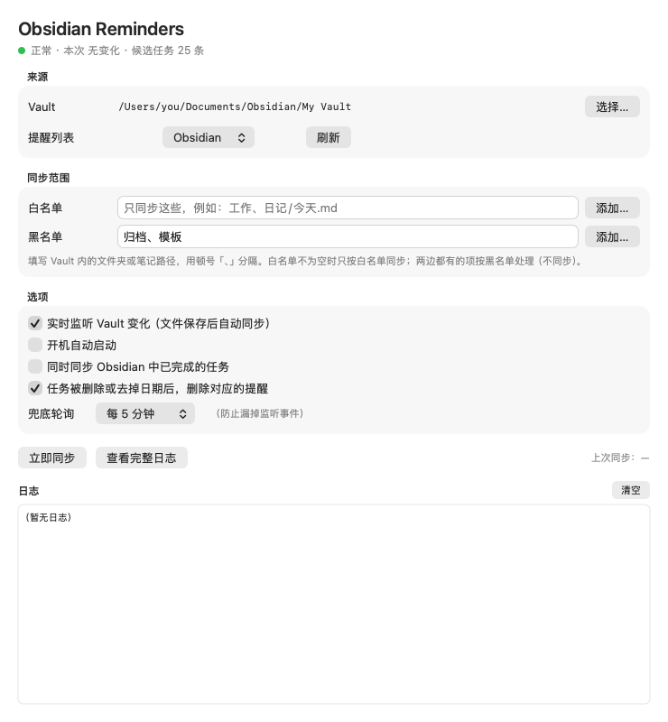

<p align="center"></p>

<h1 align="center">Obsidian Reminders</h1>

[English](README.md) | **简体中文**

一个 macOS 原生小工具：把 **Obsidian 里带日期的任务**自动放进苹果「**提醒事项**」；在提醒事项里（Mac、iPhone、手表都行）打勾完成，Obsidian 里的任务也会跟着勾上。

- 只同步带到期日（📅）或计划日（⏳）的任务，没日期的待办留在 Obsidian 里不打扰。
- 提醒标题是干净的纯文本：`[[双链]]`、`[链接](网址)`、**加粗**、`#标签` 都会被去掉。
- 双向完成：手机上勾掉 → 笔记里变成 `- [x]`；循环任务会自动生成下一期。
- 保存笔记后几秒内同步，平时安静地待在菜单栏。
- 支持白名单 / 黑名单，指定同步哪些文件夹、笔记。
- 中英文界面，跟随系统语言。

<p align="center"></p>

---

## 三分钟装好

### 你需要

| | |
|---|---|
| 一台 **macOS 14 Sonoma 或更新**的 Mac | 左上角苹果菜单  → 关于本机，可以看版本 |
| 装好 **Obsidian**，并且至少有一个库（Vault） | 到 [obsidian.md](https://obsidian.md/download) 下载 |
| 系统自带的「**提醒事项**」App，并开启了 iCloud 或「在我的 Mac 上」账户 | macOS 自带，无需安装 |

### 第 1 步：安装

**方法 A（最简单）：终端里粘贴一行**

1. 按 **⌘ 空格**，输入 **终端**（或 Terminal），按 **回车**。
2. 复制下面这一行，粘贴到终端窗口，按 **回车**：

   ```bash
   curl -fsSL https://raw.githubusercontent.com/YorenZZZ/obsidian-reminders/main/scripts/install-latest.sh | bash
   ```

3. 等出现「Done / 完成」，App 会自动打开。终端可以关掉了。

**方法 B：手动下载**

1. 打开 [最新版本页面](https://github.com/YorenZZZ/obsidian-reminders/releases/latest)，下载 **Obsidian-Reminders.zip**。
2. 双击 zip 解压，把 **Obsidian Reminders** 拖进「**应用程序**」文件夹。
3. 双击打开。系统会提示 *"Apple 无法验证……是否包含恶意软件"* —— 这是没有上架 App Store 的免费软件的正常提示。点 **完成**（或 **取消**）。
4. 打开  → **系统设置** → **隐私与安全性**，往下滚动，在「Obsidian Reminders」旁点 **仍要打开**，输入密码或按指纹确认。

> 第 3、4 步只需要做一次。

### 第 2 步：允许访问

第一次打开时，系统会弹出两个询问，**都选允许**：

1. **"Obsidian Reminders" 想要访问你的提醒事项** → 点 **允许**（如果有选项，选「完全访问」）。
2. **"Obsidian Reminders" 想要访问"文稿"文件夹中的文件**（库放在「文稿」里才会问）→ 点 **允许**。

### 第 3 步：确认生效

1. App 窗口的 **Vault** 一栏会自动显示你的库（从 Obsidian 自己的设置里读取）。如果显示「未设置」，点 **选择…**，选中你的库文件夹（里面有隐藏的 `.obsidian` 文件夹的那个）。
2. 打开「**提醒事项**」App，会多出一个叫 **Obsidian** 的列表，里面就是你带日期的任务。

搞定。App 会常驻在右上角菜单栏（清单图标），开机自动启动。关掉窗口（⌘W）不影响同步。

---

## 怎样写任务才会同步

正常写 Obsidian 任务，加上 📅（到期）或 ⏳（计划）日期即可。社区插件 [Tasks](https://publish.obsidian.md/tasks/) 可以帮你插入这些符号，手打也完全可以。

```markdown
- [ ] 交房租 📅 2026-10-01
- [ ] 给[[妈妈]]打电话 ⏳ 2026-10-03
- [ ] 看牙医 📅 2026-10-10 14:30
- [ ] 给花浇水 🔁 every week on Sunday 📅 2026-09-27
```

| Obsidian 写法 | 提醒事项里 |
|---|---|
| `📅 YYYY-MM-DD`（可加 ` HH:mm`） | 到期日期 / 时间 |
| `⏳ YYYY-MM-DD` | 没有 📅 时作为到期日，否则作为开始日期 |
| `🛫 YYYY-MM-DD` | 开始日期 |
| `⏰ YYYY-MM-DD HH:mm` | 提醒闹钟 |
| `🔺` `⏫` `🔼` `🔽` `⏬` | 优先级（高 → 低） |
| `🔁 every …` | 原生重复（提醒事项能精确表示的规则才会设置） |
| 已完成任务上的 `✅ YYYY-MM-DD` | 完成日期 |

标题精简示例：

| Obsidian 里 | 提醒事项里 |
|---|---|
| `[[宠物#每周\|给猫梳毛]]` | `给猫梳毛` |
| `[[健身#饮食]]` | `健身 饮食` |
| `续费[example.com](https://example.com)` | `续费example.com` |
| `**重要** 审查 \`代码\` #工作` | `重要 审查 代码` |

**同步规则**

- 在 Obsidian 勾选任务 → 提醒标记为完成；取消勾选 → 提醒恢复未完成。
- 删除任务或去掉日期 → 对应提醒被删除（也可以在选项里改成「只标记完成」）。
- 在提醒事项里完成（Mac、iPhone、手表都行）→ Obsidian 里变成 `- [x]`；有 `🔁` 规则的会像 Tasks 插件一样生成下一期。
- 在提醒事项里改标题、改日期**不会**同步回 Obsidian —— 以 Obsidian 为准。
- 你自己在这个列表里手动建的提醒，工具永远不会动。

---

## 指定同步范围（白名单 / 黑名单）

在「**同步范围**」里填写 Vault 内的文件夹或笔记路径，多个之间用顿号「、」分隔（逗号也行），也可以点 **添加…** 直接选。

| 白名单 | 黑名单 | 同步哪些 |
|---|---|---|
| 空 | 空 | 整个库 |
| 空 | `归档、模板` | 除了 `归档/` 和 `模板/` 以外的全部 |
| `工作、日记/今天.md` | 随便填什么 | **只**同步 `工作/` 和 `日记/今天.md` |
| `工作、生活` | `生活` | 只同步 `工作/` —— 两边都有的项按黑名单处理 |

规则：**白名单不为空时，只按白名单同步**；**同一项同时出现在两边时，以黑名单为准**（不同步）。

文件夹包含其下所有子文件夹；笔记的 `.md` 后缀可写可不写。停止输入 1.5 秒后生效，被排除范围内的任务对应的提醒会被移除。

---

## 选项说明

| 选项 | 默认 | 说明 |
|---|---|---|
| 提醒列表 | `Obsidian` | 不存在会自动创建 |
| 实时监听 Vault 变化 | 开 | 保存笔记后 1～3 秒同步 |
| 开机自动启动 | 开 | 也能在 系统设置 → 通用 → 登录项 里看到 |
| 同时同步已完成的任务 | 关 | 把 `- [x]` 也作为已完成提醒同步 |
| 任务删除后删除对应提醒 | 开 | 关闭则改为标记完成 |
| 兜底轮询 | 每 5 分钟 | 防止漏掉文件变更事件 |

快捷键：**⌘R** 立即同步 · **⌘W** 关闭窗口（后台继续运行）· **⌘1** 显示窗口 · **⌘Q** 退出。

---

## 常见问题

| 现象 | 解决办法 |
|---|---|
| 提示「未检测到 Obsidian」 | 先安装 [Obsidian](https://obsidian.md/download) 并创建一个库；或者点 **选择…** 直接选一个放 Markdown 笔记的文件夹。 |
| 提示「提醒事项访问权限被关闭了」 | 点 **打开系统设置**，在 隐私与安全性 → 提醒事项 里打开「Obsidian Reminders」。切回 App 就会自动开始同步，不用重启。 |
| 提示「提醒事项里没有可用的账户」 | 打开「提醒事项」→ 设置 → 账户，启用 iCloud 或「在我的 Mac 上」，然后点 **立即同步**。 |
| 某个任务没有出现 | 检查：是 `- [ ]` 任务行；有 📅 或 ⏳，日期格式是 `YYYY-MM-DD`；在白名单内 / 不在黑名单里。 |
| 提示「已在提醒事项完成，但无法回写 Obsidian」 | 勾选提醒之后，这行任务在 Obsidian 里被改过，无法安全对上。到 Obsidian 里手动勾掉即可，提示会自动消失。 |
| 「Apple 无法验证……」打不开 | 见上面「方法 B」第 4 步。 |
| 其他问题 | 点 **查看完整日志**，看最后几行。 |

---

## 卸载

1. 点菜单栏图标 → **退出**。
2. 把「应用程序」里的 **Obsidian Reminders** 拖进废纸篓。
3. （可选）彻底清理：在终端粘贴运行

   ```bash
   rm -rf ~/Library/Application\ Support/ObsidianReminders ~/Library/Logs/ObsidianReminders
   ```
   ```bash
   defaults delete io.github.yorenzzz.obsidian-reminders
   ```

提醒事项里的 **Obsidian** 列表会保留，不需要的话在提醒事项里删掉即可。

---

## 开发者

<details>
<summary>从源码构建、测试、实现原理</summary>

需要 Xcode 命令行工具（`xcode-select --install`），不需要 Xcode 工程，直接用 `swiftc` 编译。

```bash
git clone https://github.com/YorenZZZ/obsidian-reminders.git
cd obsidian-reminders
./install.sh              # 构建通用版 → 安装到 /Applications → 启动
./scripts/release.sh      # 打包 build/Obsidian-Reminders.zip，用于发布
```

App 使用 ad-hoc 签名，每次重新编译后系统会视为新 App，需要重新授权一次提醒事项。

测试：

```bash
swiftc -o /tmp/parse-test Sources/TaskParser.swift Sources/Log.swift Sources/Recurrence.swift Tools/parser-test/main.swift && /tmp/parse-test
swiftc -o /tmp/regress Sources/TaskParser.swift Sources/Log.swift Sources/Recurrence.swift Sources/NativeRecurrence.swift Tools/completion-regression/main.swift && /tmp/regress
swiftc -o /tmp/path-filter-test Sources/PathFilter.swift Tools/path-filter-test/main.swift && /tmp/path-filter-test
```

命令行调试（不打开界面）：

```bash
APP="/Applications/Obsidian Reminders.app/Contents/MacOS/ObsidianReminders"
"$APP" --dry-run    # 只扫描并打印将要同步的任务，不碰提醒事项
"$APP" --dump       # 打印上次同步写入的内容
```

如何识别自己建的提醒：提醒事项没有隐藏字段，所以工具在本地索引 `~/Library/Application Support/ObsidianReminders/reminder-index.json` 里记录「任务 ID（文件路径 + 精简标题的哈希）→ 提醒」。不是它建的提醒一律不改。因此在 Obsidian 里改任务标题，会删掉旧提醒、新建一条。

| 内容 | 位置 |
|---|---|
| 日志 | `~/Library/Logs/ObsidianReminders/app.log` |
| 索引、同步快照、列表状态 | `~/Library/Application Support/ObsidianReminders/` |
| 设置 | `~/Library/Preferences/io.github.yorenzzz.obsidian-reminders.plist` |

源码结构见 [英文 README](README.md#for-developers)。

</details>

---

## 许可

[MIT](LICENSE)。与 Obsidian、Apple 官方无关。
